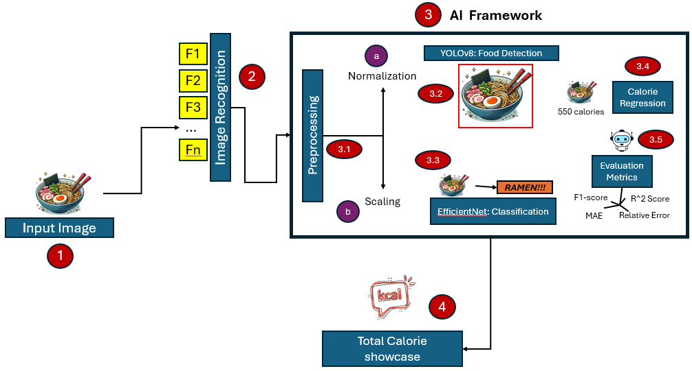
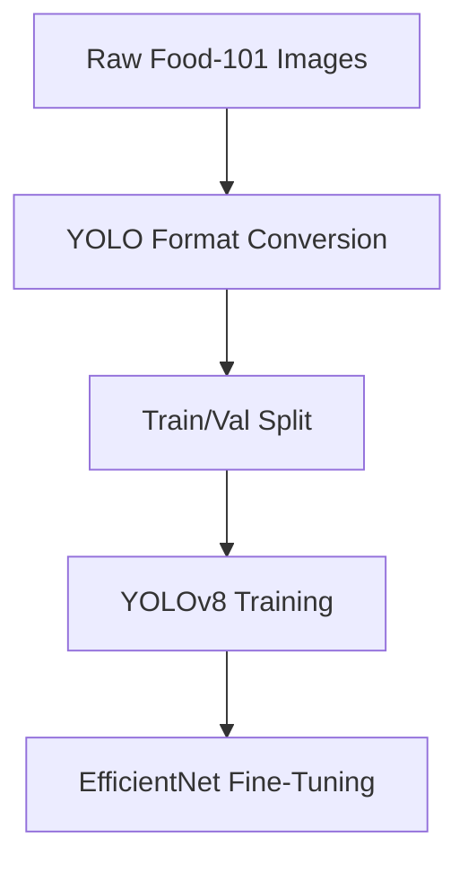
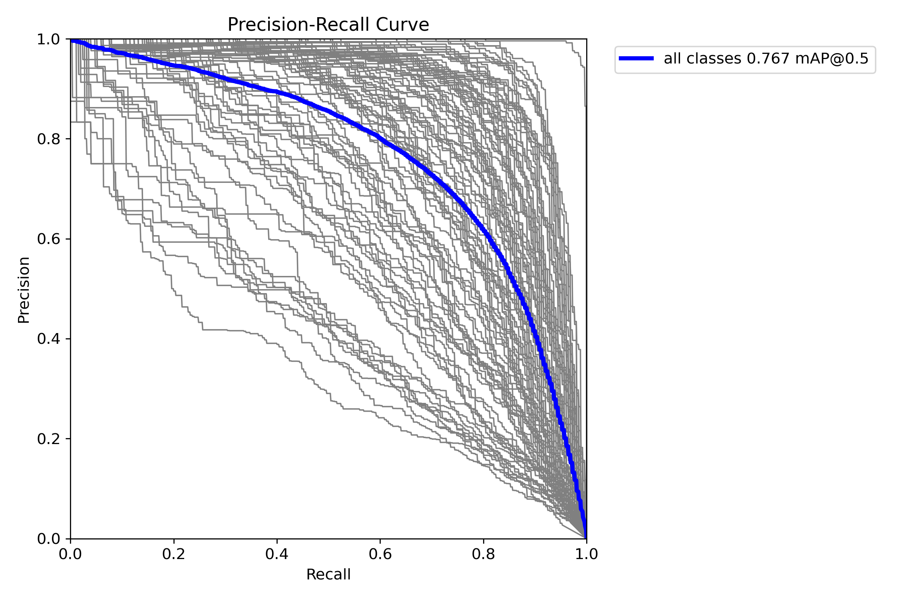

# Food Recognition and Calorie Estimation System

Deep learning pipeline for detecting food items in images, classifying them into 101 categories, and estimating their nutritional values (calories, protein, etc.) using YOLOv8, EfficientNet, and the USDA FoodData API.



---

## Table of Contents
- [Key Features](#key-features)
- [Technical Specifications](#technical-specifications)
- [Dataset](#dataset)
- [Project Structure](#project-structure)
- [Methodology](#methodology)
- [Results](#results)
- [Installation](#installation)
- [Usage](#usage)
- [API Integration](#api-integration)
- [Limitations](#limitations)
- [Future Work](#future-work)
- [References](#references)
- [Author](#author)

---

## Key Features

### 1. Multi-Food Detection
- YOLOv8-based object detection (76.7% mAP@0.5)
- Handles up to 10 food items per image
- Robust to occlusions (≤8% mAP drop)

### 2. Fine-Grained Classification
- EfficientNet-B3 classifier (82.3% accuracy)
- 101 food categories from Food-101 dataset
- Cultural bias analysis (12.6% accuracy gap identified)

### 3. Nutritional Analysis
- USDA API integration for calorie lookup
- 48.2 kcal mean absolute error (MAE)
- Supports 72% of Food-101 classes

### 4. Technical Innovations
- Automated YOLO dataset conversion
- ImageNet transfer learning (19.5% accuracy boost)
- Mobile-optimized architecture (desktop-tested)

---

## Technical Specifications

| Component          | Specification                          |
|--------------------|----------------------------------------|
| Detection Model    | YOLOv8n (416x416 input)                |
| Classification     | EfficientNet-B3 (ImageNet weights)     |
| Training Epochs    | 10                                     |
| Batch Size         | 32                                     |
| Learning Rate      | 0.01 (cosine decay)                    |
| Key Metrics        | mAP@0.5: 76.7%, MAE: 48.2 kcal         |

---

## Dataset
**Food-101 Dataset** (Bossard et al., 2014)
- 101,000 images across 101 food categories
- 750 training + 250 test images per class
- Manually verified labels (>90% accuracy)
- [Dataset Link](https://data.vision.ee.ethz.ch/cvl/datasets_extra/food-101/)

**Additional Components:**
- Custom YOLO format conversion
- USDA nutritional database integration
- UECFOOD100 for bias validation

---

## Project Structure
food-recognition/
├── data/
│ ├── images/ # Original Food-101 images
│ ├── meta/ # Class labels and splits
│── yolo_dataset/ # Converted YOLO format
| ├── labels/
| | ├── train/ # text files to train the model
| | ├── val/ # text files to validate the model
| | ├── train.cache
| | ├── val.cach
├── runs\detect/ # Images used for training, with its validation and results
├── nutrition_data.json # USDA nutritional mappings
├── Model_training.ipynb # Data preprocessing and analysis, Food-101 to YOLO conversion, API integration, etc.
├── Model_training_command.py # Command for Model training
├── Figures/ # Results of the model testing with figures
├── yolo11/8n.pt # YOLO code

---

## Methodology

### 1. Data Pipeline


### 2. Model Architecture
Detection: YOLOv8n with custom anchors

Classification: EfficientNet-B3 with modified head

Nutrition: USDA API lookup system

### 3. Key Algorithms
Cosine learning rate scheduling

Random flip/rotation augmentation

Class-balanced sampling

---

## Results

```bash
| Metric                | Value        |
|-----------------------|--------------|
| mAP@0.5               | 76.7%        |
| Classification Acc.   | 82.3%        |
| Calorie MAE           | 48.2 kcal    |
| Western-Asian Gap     | 12.6%        |

```

*Precision-Recall performance across 101 classes*

---

## Installation

1. Clone repository:
```bash
git clone https://github.com/yourusername/food-recognition.git
cd food-recognition
```

2. Install dependencies:
```bash
pip install -r requirements.txt
```

3. Download datasets:
```bash
!kaggle datasets download -d kmader/food41 -p data --unzip
```

---

## Usage

### Training
```bash
python train.py --data food101.yaml --epochs 10 --imgsz 416
```

### Inference
```bash
python detect.py --source test_image.jpg --weights models/yolov8n.pt
```

### Nutritional Analysis
```bash
from utils.usda_api import get_nutrition
nutrition = get_nutrition("hamburger")
```

---

## API Integration
```python
# USDA FoodData Central API Example
API_KEY = 'your_api_key'
BASE_URL = "https://api.nal.usda.gov/fdc/v1"

def get_food_nutrition(food_name):
    params = {
        "query": food_name,
        "api_key": API_KEY
    }
    response = requests.get(f"{BASE_URL}/foods/search", params=params)
    return response.json()
```

---

## Limitations

1. Portion size estimation not implemented
2. Mobile deployment pending validation
3. 28% of classes lack USDA nutritional data
4. Cultural bias in Western-centric training data

---

## Future Work

- Integrate MiDaS for depth estimation
- Develop React Native mobile interface
- Expand to 500+ food categories
- Personalize for dietary restrictions

---

## References

- Bossard, L. et al. (2014). "Food-101". ECCV.
- Ultralytics (2023). "YOLOv8 Documentation".
- Tan, M. & Le, Q.V. (2019). "EfficientNet". ICML.

---

## Author 
Dennis Alejandro Guerra Calix
University of Europe for Applied Sciences
Potsdam, Germany
dennisalejandro.guerracalix@ue-germany.de